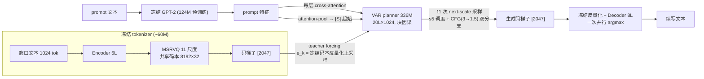
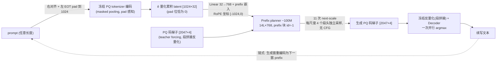

# CADENCE 两代训练对比报告：336M STAR 旗舰 vs 100M Prefix+PQ 重设计

日期：2026-08-28。本文对比**上一次训练**（Stage 2 旗舰，2026-08-24 收官，`planner_owt1024`）与**这一次训练**（A+B 重设计，2026-08-27/28 收官，`planner_prefix_100m_pq{sh,ps}`）的设置、架构与结果，并给出差距归因与下一步建议。

---

## 1. TL;DR

- 这一次把三处设计同时重做：**A** 乘积量化 tokenizer（S=4×N=64，shared/per-scale 两版）、**B** prompt 改为自家 latent 的 in-context prefix（删除冻结 gpt2 encoder 与 cross-attention）、**C** 彻底去掉 CFG；模型缩到 ~100M 快迭代。
- **Tokenizer 层全胜**：两版 PQ 重建 99.95%+（旧 99.76%），变长增强根治了 pad-OOD（任意长度 prompt 编码重建 ≥99.6%）。
- **Planner 层**：shared vs per-scale ≈ 平手（per-scale 微优）——码本共享方式不是瓶颈；100M 新架构在 Wikipedia MAUVE 上（9.37）超过同尺寸 TextLDM-114M（8.9）与全部重训 GPT-2（≤8.2），但对自家 336M 旧旗舰全面回退（26.0→9.4）。
- 回退是**预告过的三个 handicap +3.4× 缩模 + 60× 吞吐差**的叠加；因无同尺寸旧架构对照，各因素贡献暂不可分解。

---

## 2. 设置对比

### 2.1 Tokenizer（两代都是冻结后供 planner 使用）

| | 上一次：`vqvae_owt9_1024_d5` | 这一次：`vqvae_owt9_1024_pqsh` / `pqps` |
|---|---|---|
| 骨架 | encoder 6L×512（8h）→ Linear 512→32 → MSRVQ → decoder 8L×512 | 同左（骨架未动） |
| 量化 | **单一共享码本 8192×32**，VQ-EMA | **乘积量化：4 段 × 每段 64 条目 × 8 维**；`pqsh`=跨尺度共享 / `pqps`=每尺度独立码本；向量化 PQ-VQEMA（每次更新仍仅 2 次 all-reduce） |
| 每位置信息量 | 13 bits（8192 类） | 24 bits（64⁴ ≈ 1680 万组合） |
| 尺度表 | [1,2,4,…,1024] 11 级，scale_dropout 0.5 | 同左 |
| 变长窗增强 | 无（只见过整窗） | **25% 样本裁成右对齐尾部 + 左 EOT pad**，masked pooling / masked EMA / masked loss |
| 训练 | 150k 步，batch 256，owt9 9.5B | 同口径 150k；4 节点 DDP（train_entry 多节点移植），~3.5h/个 |
| 码导出格式 | int16 `[n, 2047]` | uint8 `[n, 2047, 4]` + codes_meta v2（PQ 指纹 + codebook sha256 校验） |

### 2.2 Planner

| | 上一次：`planner_owt1024`（336M） | 这一次：`planner_prefix_100m_pq*`（~103M） |
|---|---|---|
| 主干 | 20L × 1024 × 16h | 14L × 768 × 12h |
| **prompt 条件** | STAR 双通道：**冻结 gpt2（124M 预训练）** 编 prompt → 每层 cross-attention + attention-pool 出 [S] 起始 | **in-context prefix**：prompt 窗（同文档尾部右对齐 + 左 EOT pad）经冻结 tokenizer 编码为量化累积 latent ê `[1024,32]` → Linear 投影后接在序列最前（无外部 encoder、无 cross-attn） |
| 序列布局 | 2047（码梯子） | 3071 = 1024 prefix + 2047 梯子；prefix 块 id=-1（prefix 内双向、target 可见 prefix、prefix 永不见 target）；RoPE 坐标 prefix ∈ [-1024,0)、target ∈ [0,1024) |
| CFG | cond_drop 0.1，推理 CFG 调度（粗尺度 3 → 细尺度 1.5） | **无**（cond_drop=0，无 null 通路，采样单分支） |
| 输出头 | 单 Linear(1024→8192) | **每尺度 Linear(768→4×64) 段头**；段间独立采样（depth-AR 为预留备胎） |
| 训练 | 150k 步 ≈ 39B token（4.1 epoch owt9），lr 2e-4 | 100k 步 ≈ 26B token（2.8 epoch），lr 3e-4；prompt 在线编码（冻结 tokenizer 常驻） |
| 推理 | 11 次前向 + 1 次并行解码；调度 s5 | 同拍；无-CFG 调度四行扫描，胜者 `pqps`=p5cold / `pqsh`=p5hot；链式=decode→re-encode |

---

## 3. Framework 图

### 3.1 上一次：STAR 条件 + CFG（336M）

### 3.2 这一次：Prefix 条件 + PQ 段头，无 CFG（~100M）

两图共同点：VAR 式 next-scale 生成（11 次前向）+ decoder 一次并行渲染。差异集中在**条件通路**（外挂预训练 encoder+cross-attn vs 自家 latent prefix）、**码空间**（单码本 vs 乘积量化）与**引导**（CFG vs 无）。

---

## 4. 结果

### 4.1 Tokenizer 级（150k 全量，test）

| | pqsh | pqps | 旧 d5 |
|---|---|---|---|
| 全量重建 acc | 99.953% | **99.968%** | 99.76% |
| 截断梯子 q512 acc | 0.756 | **0.794** | – |
| pad 桶重建（保留 32/128/512 tok） | ≥99.7% | ≥99.6% | 未训 pad（推定 OOD） |
| 段独立采样最坏 acc 掉幅（探针） | 17.0pp | **11.8pp** | – |

### 4.2 调度扫描（sel 选择集 4×250，R1/R2/MAUVE ×100；预注册规则：sel_wikipedia MAUVE > R1 > sel_wikisource MAUVE）

| 调度 | pqps Wikipedia | pqps WikiSource | pqsh Wikipedia | pqsh WikiSource |
|---|---|---|---|---|
| p5 | 21.9/2.0/10.0 | 27.1/2.6/12.4 | 22.9/2.3/9.8 | 27.9/3.0/18.7 |
| p5hot | 21.4/1.9/11.7 | 26.4/2.6/8.3 | **22.6/2.4/14.4** ✓ | 27.3/2.9/20.4 |
| p5cold | **23.1/2.4/12.1** ✓ | 28.7/3.1/12.8 | 24.1/2.7/13.5 | 29.2/3.5/20.7 |
| pflat（标量） | 20.0/1.6/6.2 | 25.3/2.1/4.5 | 21.1/1.6/5.0 | 26.2/2.3/5.0 |

两版的标量行均垫底：**无 CFG 之下，逐尺度采样调度仍是最大零训练杠杆**（与旧架构结论一致）。sel→test 的 MAUVE 落差再次确认 n=250 选择集只可看趋势。

### 4.3 Test 终评（4×1000，R1/R2/RL/BS/MAUVE ×100）

| 模型 | WikiSource | Wikipedia | TinyStories | 1BW |
|---|---|---|---|---|
| **pqps**（per-scale，p5cold） | 28.3/2.7/13.8/78.9/3.48 | 24.5/2.6/12.6/78.1/**9.37** | 26.1/2.1/14.4/81.4/0.54 | 8.6/0.3/7.3/81.5/0.54 |
| **pqsh**（shared，p5hot） | 27.6/2.6/13.6/78.8/4.45 | 23.7/2.4/12.2/78.0/8.47 | 24.7/1.8/13.9/81.2/0.56 | 8.9/0.3/7.6/81.5/0.56 |
| 336M 旧旗舰（s5） | 30.6/4.4/–/79.9/**15.2** | 26.2/3.9/–/79.1/**26.0** | 30.7/4.2/–/83.4/0.65 | 10.8/0.6/–/82.2/0.62 |
| TextLDM-114M | 33.0/6.6/16.6/80.3/21.6 | 27.5/5.9/15.9/81.0/8.9 | 36.7/7.8/20.7/84.8/1.00 | 10.3/0.7/9.4/83.1/0.77 |
| GPT-2-137M（重训） | 31.1/7.0/18.2/81.6/35.3 | 23.3/4.7/15.1/81.6/7.9 | 31.8/6.1/18.9/85.5/1.04 | 13.4/1.6/12.3/83.9/0.45 |

读法：
- **shared vs per-scale ≈ 平手，pqps 微优**（主指标 Wikipedia MAUVE 9.37 vs 8.47，R1 全线略高，tokenizer 各项亦优；pqsh 仅 WS MAUVE 反超）。**码本共享方式不是瓶颈**——本轮最干净的单变量结论。
- 100M 新架构 Wikipedia MAUVE **超过同尺寸 TextLDM-114M 与全部重训 GPT-2**；其余指标（R1/R2/BS）低于同档。
- 对自家 336M 旧旗舰全面回退；WS MAUVE 回退最重（15.2→3.5/4.5）。

---

## 5. 差距归因（training data / base model / 训练步数）

对标口径先摆平：TextLDM 论文中的 TextLDM 与 GPT-2 行**均为作者在 OpenWebText2（~17B token）上用 Qwen3 tokenizer 从头重训**，DiT 2M 步、每步 ~80 万 token。

1. **训练步数/吞吐（最大可量化因素）**：我们 100k 步 ≈ **26B token**；基线 ≈ **1.6T token（差 60×，≈94 epoch）**。我们两个 planner 的 val 曲线至 100k 仍在下降（欠训铁证）。多 epoch 复读对此类模型并非禁忌（基线先例），我们的 ≤4-epoch 红线源自 AR 过拟合教训，对几乎不过拟合的 planner 可能过于保守。
2. **训练数据（次要）**：语料家族相同（OpenWebText vs OpenWebText2），体量仅差 1.8×；真实差异是 **Qwen3 词表≈3× GPT-2 BPE**——同样 1024 位置携带更多文本、罕见词切分更整，对 R1/R2 有系统性优势，但解释不了 MAUVE 差距。
3. **Base model（本轮自加三个 handicap + 一个固有结构差）**：
   - 删除 124M 预训练 gpt2 encoder：基线也是 from-scratch，但用 60× token 补齐；我们 from-scratch 且低吞吐，两头不占（R1/忠实度回退，事先预告）；
   - 去 CFG：旧旗舰 MAUVE 明确依赖 CFG=3（在库证据），事先预告的 MAUVE 回退兑现；
   - PQ 段间独立采样：位置内 4 段无联合约束（探针最坏 12-17pp），叠在 R2 病根上；
   - 固有结构差：我们是"planner 预测码 + 冻结 decoder 一锤子渲染"，无纠错机制；TextLDM 迭代去噪、GPT-2 逐 token 序贯——都能"边生成边修"。R2 全线偏低的根因（Track 1 起确诊）。

**嫌疑排序**：吞吐 60×（可修，最便宜）＞ 三 handicap 合计（26.0→9.4 的主责，无对照不可分解）＞ 3.4× 缩模 ＞ 一次性解码结构 ＞ Qwen3 词表 ＞ 语料 1.8×。

---

## 6. 已知局限与下一步（待拍板）

局限：① 无同尺寸旧架构对照，A/B/C 三处改动的贡献不可分解；② cond_drop=0 使 CFG 选项在这两个 ckpt 上永久不可回测；③ REFINE 接线 bug 仍在旧 generate.py 中未修（round 11 精化结论不可引用）；④ sel 选择集小样本 MAUVE 噪声大。

建议（按性价比）：
1. **续长训**：owt9 上 pqps/pqsh 100k→300k-500k（多 epoch 有基线 94-epoch 先例；盯 val 防过拟合），或导 C4 码（40B 已备）跑干净长 schedule——直接回收"欠训"这一最大变量；
2. **100M 旧架构对照**（旧码+gpt2+CFG，同步数）：拆开架构效应 vs 尺寸效应；
3. **cond_drop=0.1 版重训**（推理 CFG on/off 成对行）：单变量回收 C；
4. **depth-AR 段采样头**：对症 R2/段独立风险；
5. 以上过闸后再 336M 新架构 → 768M。

产物索引：checkpoints `vqvae_owt9_1024_pq{sh,ps}`、`planner_prefix_100m_pq{sh,ps}`；结果 `results/benchgen_planner_prefix_100m_pq{sh,ps}/`；代码 main@5781cef（PQ 量化器 + prefix planner 两个 commit）。
